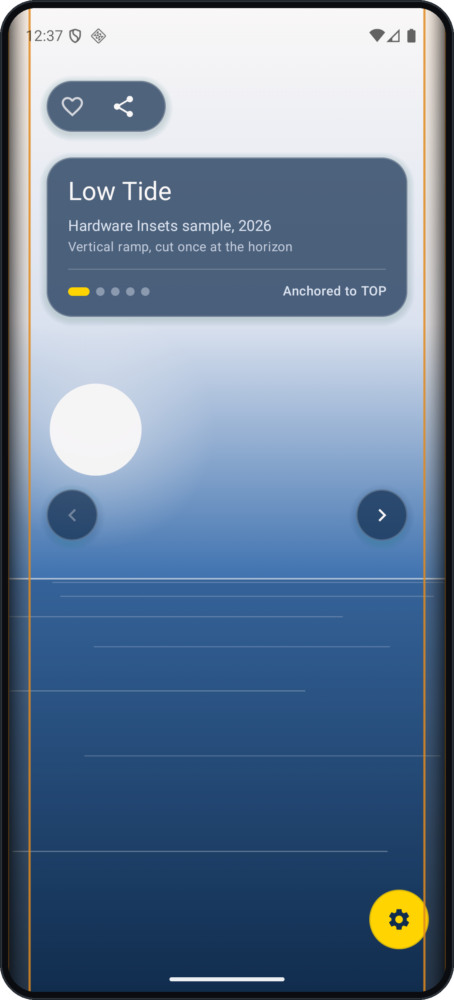
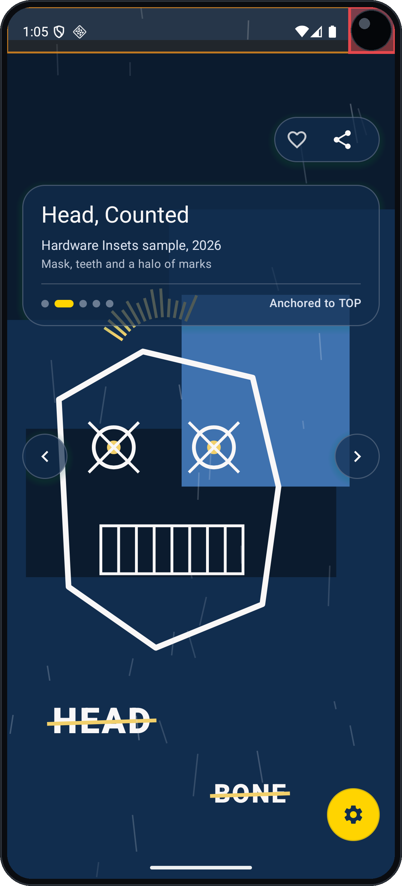
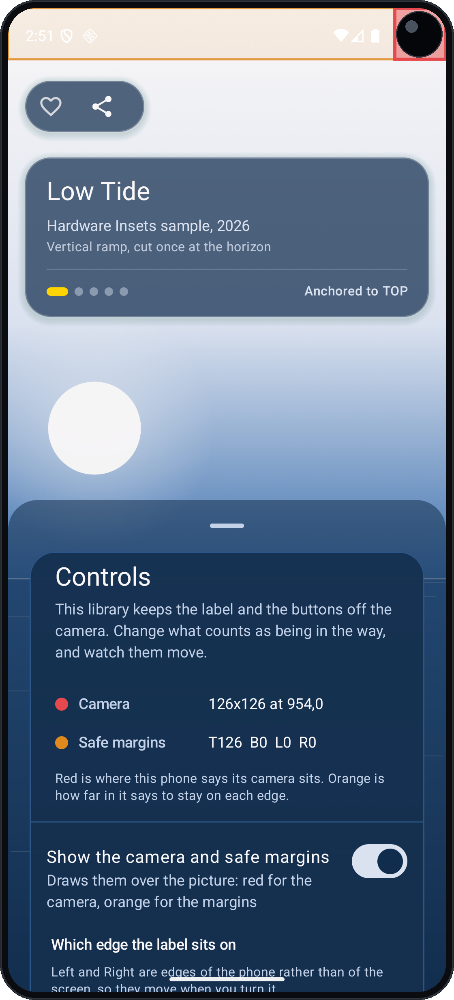
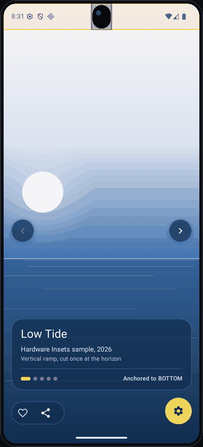

# compose-hardware-insets

[](https://jitpack.io/#damson/compose-hardware-insets)
[](https://github.com/damson/compose-hardware-insets/actions/workflows/ci.yml)
[](#supported)
[](LICENSE)
[](https://damson.github.io/compose-hardware-insets/)

Compose tells you how deep the display cutout goes into each edge. It does not tell you **where**
the camera is, so there is no supported way to ask whether the hardware is actually in the way of
one particular control.

This answers that. It publishes the cutout's rectangles as Compose state, turns them into an offset
for a control tucked into a corner, and keeps the pure geometry public so you can test it against
hardware you do not own.

| A curved edge | A camera in the corner | Marker options | One kind after another |
|---|---|---|---|
|  |  |  |  |

The same screen on different hardware, with the sample's marker overlay on: red is where the platform
says a camera is, orange is how far in it says to stay on each edge. On the left there is no rectangle
at all, only a curved edge, and everything is inset by `clearOfTheHardware`. Beside it the corner
buttons have been driven clear of the camera by `cornerClearance`, which counts only the rectangles
they actually overlap. The third reads the numbers back: a rectangle where the camera is, and a depth
per edge, which are the two different answers this library exists to keep apart. On the right the
gallery runs over one kind of hardware after another.

```kotlin
// settings.gradle.kts
dependencyResolutionManagement {
    repositories {
        maven("https://jitpack.io")
    }
}

// build.gradle.kts
dependencies {
    implementation("com.github.damson:compose-hardware-insets:0.2.0")
}
```

The corner control is kept off the camera by `cornerClearance` and off the system bars by
`clearOfTheHardware` with a bars-only policy. Those are two different questions, and the sample
keeps them apart.

## Pad content clear of the hardware

```kotlin
Box(
    Modifier
        .background(MyColours.panel)      // the background keeps the full width
        .clearOfTheHardware(ScreenEdge.TOP)  // only what is inside it backs off
) {
    ActionRow()
}
```

By default that means the display cutout and the waterfall curve, and all four edges. Both are
choices:

```kotlin
// Include the system bars too, for an app that shows them
Modifier.clearOfTheHardware(policy = HardwarePolicy(areSystemBarsIncluded = true))

// Leave the far edge at zero, for a wrap_content ComposeView that would
// otherwise grow and swallow touches inside the growth
Modifier.clearOfTheHardware(ScreenEdge.TOP, isFarEdgeIgnored = true)
```

## Move one control clear of the camera

The full-width inset is the wrong question. A centred punch-hole reports an inset across the whole
width, which would drop a corner button a centimetre to avoid a camera it is nowhere near. So read
the rectangles and count only the ones the control overlaps:

```kotlin
val cutout by someSiblingView.cutoutShape()          // live state, not a reading
val clearance = cornerClearance(cutout.bounds, ScreenEdge.TOP, isAtTheEnd = true)

Box(Modifier.offset { clearance(buttonWidthPx) }) { CloseButton() }
```

**Do not register that on the `ComposeView` itself.** A View holds exactly one
`OnApplyWindowInsetsListener` and `setContent` claims it, silently: the dispatch still arrives, the
listener is just no longer yours, and the value stays at its default. Use a sibling, and call
`stopReportingCutoutShape()` when you are done with it.

## Lay the window out behind the hardware

```kotlin
class MainActivity : ComponentActivity() {
    override fun onCreate(savedInstanceState: Bundle?) {
        super.onCreate(savedInstanceState)
        drawBehindTheHardware(cutoutMode = CutoutMode.SHORT_EDGES)
        // ALWAYS suits a surface that fills the window. Most apps want SHORT_EDGES.
    }
}
```

`hideTheSystemBars()` is a separate call, because hiding the bars and drawing behind them are
separate decisions. It takes a type mask, so you can keep the clock.

## Why the tests are the interesting part

There is no resource qualifier for a display cutout, and none at all for a curved edge. A test that
waited for a device with the hardware would only ever run on someone's desk. Every test here builds
a `WindowInsetsCompat` and dispatches it through a real layout instead, which is why the geometry is
covered on hardware nobody in this project owns.

`cornerClearanceFor` is public for the same reason it is pure: so you can ask it about a punch-hole,
a chin, a notch and three overlapping rectangles without owning any of them.

## The sample

`:sample` is a gallery: painted plates, one at a time, each running to every edge, swipe or step for
the next, tap to put the label away. The picture runs under the camera and the wall label has to stay
clear of it, which is this library's problem in one screen.

It keeps the system bars on screen and moves the label between all four edges. The previous and next
buttons are the interesting half: they sit halfway down the sides with no corner to be measured
from, so they take everything the window reports on that edge, while the corner row asks about the
rectangles it actually overlaps. Two controls, two policies, one screen.

It depends on the library as a Gradle project, so an API change breaks it in the same build.

Two things writing it proved:

- **Reading the cutout in a Compose-only app costs twelve lines of `View` code.** You need a sibling
  view for the listener, which means a `FrameLayout`, which means building the content view by hand.
  `ViewerActivity` does it with the reason written down. That is what `rememberCutoutShape()` is for,
  and the sample is why it is the first roadmap item rather than a nice-to-have.
- **The bar icons are a parameter of `drawBehindTheHardware`, not something to set after it.** It
  goes through `enableEdgeToEdge`, which re-picks light or dark icons on every call, so an
  appearance set separately is undone by the next one. Pass `statusBarStyle` and
  `navigationBarStyle` and the question does not arise. An app that changes the appearance between
  those calls, as a viewer deciding per picture does, still has to set it again after each one, and
  the only symptom of getting that wrong is a clock nobody can read.

The first is on the roadmap. The second is why those two parameters exist.

## API reference

[The generated documentation](https://damson.github.io/compose-hardware-insets/). Published on every
release and pinned to that release's tag, so the "source" link beside a declaration points at the code
that version shipped rather than at whatever `main` holds now.

## Supported

- `minSdk 23`, which is Compose's floor rather than this library's. The cutout API arrives at API
  28 and the waterfall at API 30; below each, the platform reports nothing and this reports zero, so
  there is nothing to branch on in your code.
- **`compileSdk 36` or later in your project, and AGP 8.9.1 or later.** Neither is this library's
  floor. `androidx.activity` 1.13 and `androidx.core` 1.18 each declare both in their aar metadata,
  and they reach you because this exports Compose and Activity and carries `core` on the runtime
  classpath. This library's own aar asks for `compileSdk 30`, the highest platform API its code
  touches. Below either floor the dependency resolves and then `checkDebugAarMetadata`, or
  `checkReleaseAarMetadata` for a release build, fails with a message naming the artifact that
  wants more and the `compileSdk` your module is on.
- **Kotlin 2.3.0 or later in your project.** This is built with 2.4.20, and a Kotlin compiler reads
  metadata from its own version and one minor back, so a 2.2 compiler cannot read it:

  ```
  Module was compiled with an incompatible version of Kotlin.
  The binary version of its metadata is 2.4.0, expected version is 2.2.0.
  ```

  What that asks of you is the Kotlin plugin version in your build, and nothing in your code.
  `0.1.0` was built with 2.2.21, so this is the only requirement that moved.

## Status

This generalises code that has been in production in one app. The API is expected to move before
`1.0`; see [CHANGELOG.md](CHANGELOG.md) and the roadmap below.

## Roadmap

- `rememberCutoutShape()` and a `LocalCutoutShape`, so a Compose-only app never touches a `View`.
  The sample shows what this costs today.
- Rounded-corner insets. The platform reports corners as a radius from API 31 rather than as an
  inset, and Compose does not expose them either.
- A safest-edge chooser: given the shape, which edge has the least hardware in it.
- `Modifier.avoidHardware()`, offsetting a composable clear of any rectangle it overlaps.
- Fold and hinge support through `androidx.window`. The same problem: hardware in the way.
- A debug overlay drawing the cutout rectangles, the waterfall and the safe areas over your UI.
- A `-testing` artifact shipping the fake-cutout fixtures.
- `cornerClearance` on a vertical edge. It answers zero there today and says so; supporting it means
  measuring a control's height against a side, which is a different calculation.

## Licence

Apache 2.0. See [LICENSE](LICENSE).
